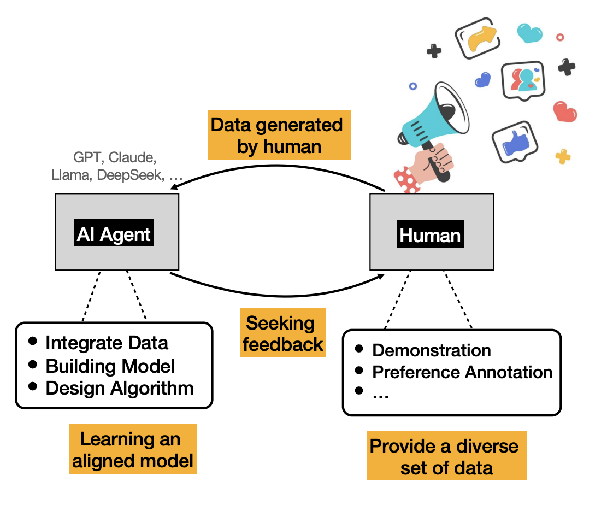

# Aligning Large Language Models with Human Feedback: Mathematical Foundations and Algorithm Design

## Abstract

This article provides an introduction to the mathematical foundations and algorithmic frameworks used to align Large Language Models (LLMs) with human intentions, preferences, and values. We discuss standard alignment techniques, such as fine-tuning (SFT), reinforcement learning with human feedback (RLHF), and direct preference optimization (DPO). We also explore the theoretical underpinnings of learning from human preferences, drawing connections to inverse reinforcement learning (IRL) and discrete choice models. We present state-of-the-art algorithms in a tutorial style, discuss their advantages and limitations, and offer insights into practical implementation. Our exposition is intended to serve as a comprehensive resource for researchers and practitioners, providing both a foundational understanding of alignment methodologies and a framework for developing more robust and scalable alignment techniques.

## Alignment Framework Illustration

*Figure: Overview of the alignment framework and methodologies discussed in this survey.*

## Key Topics

1. Learning from Human Preferences, Reinforcement Learning from Human Feedback
2. Learning from Demonstrations, Inverse Reinforcement Learning
3. Alignment Methodologies
4. Algorithm Design and Implementation
5. Practical Considerations and Limitations

---
